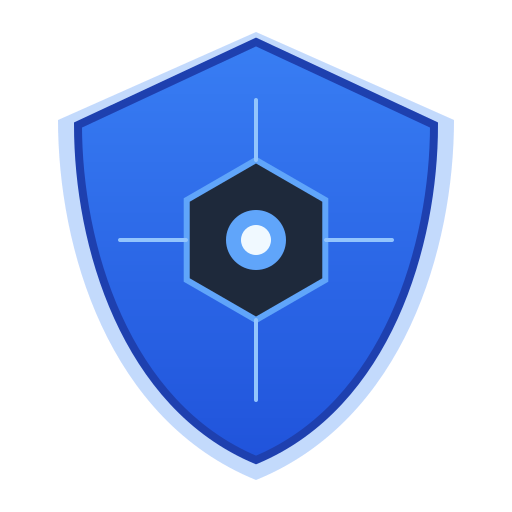

# CrowdSec Web UI

A modern, responsive web interface for managing [CrowdSec](https://crowdsec.net/) alerts and decisions. Built with **React**, **Vite**, and **Tailwind CSS**.

## Features

-   **Dashboard**: High-level overview of total alerts and active decisions.
-   **Alerts Management**:
    -   View detailed logs of security events.
    -   Filter alerts by scenario or message.
    -   Detailed modal view showing attacker IP, location, and triggered events.
-   **Decisions Management**:
    -   View active bans/decisions.
    -   **Add Manual Decisions**: Ban IPs directly from the UI.
    -   **Delete Decisions**: Unban IPs with a single click.
-   **Modern UI**:
    -   Dark/Light mode support.
    -   Responsive design for mobile and desktop.
    -   Real-time feeling with fast React interactions.

## Architecture

-   **Frontend**: React (Vite) + Tailwind CSS. Located in `frontend/`.
-   **Backend**: Node.js (Express). Acts as a proxy to the CrowdSec Local API (LAPI).
-   **Security**: The application runs as a non-root user (`node`) inside the container and communicates with CrowdSec via HTTP/LAPI. It uses **Machine Authentication** (User/Password) to obtain a JWT for full access (read/write).

## Prerequisites

-   **CrowdSec**: A running CrowdSec instance.
-   **Machine Account**: You must register a "Machine" (Watcher) for this web UI to allow it to push alerts (add decisions).
    
    1.  Generate a secure password:
        ```bash
        openssl rand -hex 32
        ```
    2.  Create the machine:
        ```bash
        docker exec crowdsec cscli machines add crowdsec-web-ui --password <generated_password> -f /dev/null
        ```
        > [!NOTE]
        > The `-f /dev/null` flag is crucial. It tells `cscli` **not** to overwrite the existing credentials file of the CrowdSec container. We only want to register the machine in the database, not change the container's local config.

## Run with Docker (Recommended)

1.  **Build the image**:
    ```bash
    docker build -t crowdsec-web-ui .
    ```

2.  **Run the container**:
    Provide the CrowdSec LAPI URL and your Machine Credentials.
    
    ```bash
    docker run -d \
      -p 3000:3000 \
      -e CROWDSEC_URL=http://crowdsec-container-name:8080 \
      -e CROWDSEC_USER=crowdsec-web-ui \
      -e CROWDSEC_PASSWORD=<your-secure-password> \
      --network your_crowdsec_network \
      crowdsec-web-ui
    ```
    *Note: Ensure the container is on the same Docker network as CrowdSec so it can reach the URL.*

### Docker Compose Example

```yaml
services:
  crowdsec-web-ui:
    image: ghcr.io/TheDuffman85/crowdsec-web-ui:latest
    container_name: crowdsec_web_ui
    ports:
      - "3000:3000"
    environment:
      - CROWDSEC_URL=http://crowdsec:8080
      - CROWDSEC_USER=crowdsec-web-ui
      - CROWDSEC_PASSWORD=<generated_password>
    restart: unless-stopped
```

## Local Development

1.  **Install Dependencies**:
    ```bash
    npm run install-all
    ```

2.  **Start the Backend**:
    ```bash
    export CROWDSEC_URL=http://localhost:8080
    export CROWDSEC_USER=crowdsec-web-ui
    export CROWDSEC_PASSWORD=<your-secure-password>
    npm start
    ```

3.  **Start the Frontend (in a separate terminal)**:
    ```bash
    cd frontend
    npm run dev
    ```
    The frontend will proxy API requests to `http://localhost:3000`.

## API Endpoints

The backend exposes the following endpoints (proxying to CrowdSec LAPI):

-   `GET /api/alerts`: List all alerts.
-   `GET /api/decisions`: List all active decisions.
-   `POST /api/decisions`: Add a new decision (Body: `{ ip, duration, reason, type }`).
-   `DELETE /api/decisions/:id`: Delete a decision by ID.
