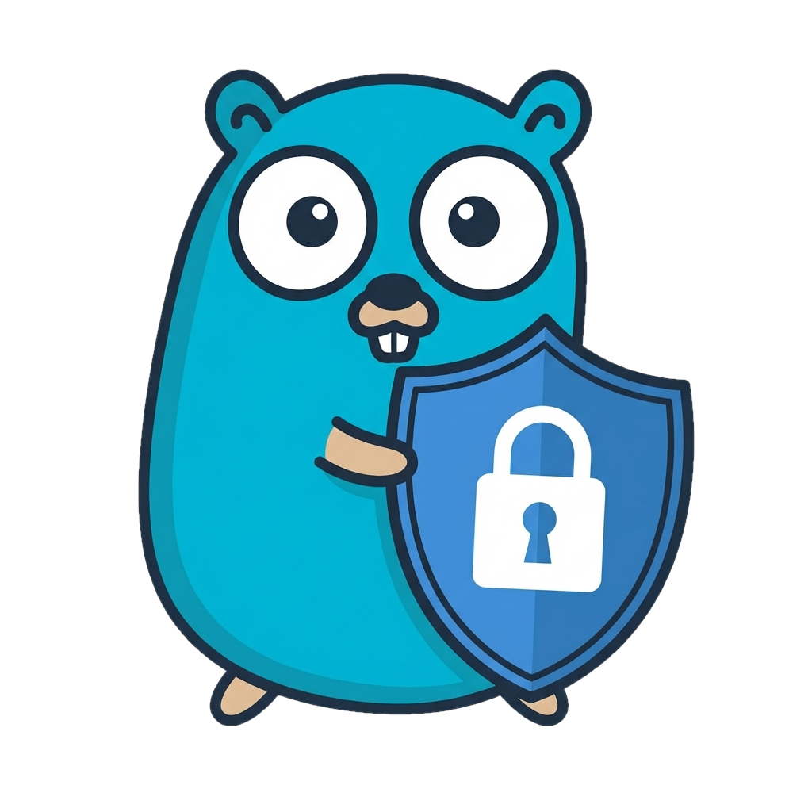

# CrowdSec Web UI

A modern, responsive web interface for managing [CrowdSec](https://crowdsec.net/) alerts and decisions. Built with **React**, **Vite**, and **Tailwind CSS**.



## Features

-   **Dashboard**: High-level overview of total alerts and active decisions.
-   **Alerts Management**:
    -   View detailed logs of security events.
    -   Filter alerts by scenario or message.
    -   Detailed modal view showing attacker IP, location, and triggered events.
-   **Decisions Management**:
    -   View active bans/decisions.
    -   **Add Manual Decisions**: Ban IPs directly from the UI.
    -   **Delete Decisions**: Unban IPs with a single click.
-   **Modern UI**:
    -   Dark/Light mode support.
    -   Responsive design for mobile and desktop.
    -   Real-time feeling with fast React interactions.

## Architecture

-   **Frontend**: React (Vite) + Tailwind CSS. Located in `frontend/`.
-   **Backend**: Node.js (Express). Acts as a wrapper around the `cscli` command-line tool.
-   **Communication**: The backend executes `docker exec` commands to interact with the main CrowdSec container.

## Prerequisites

-   **Docker**: The application runs as a container and needs access to the CrowdSec container.
-   **CrowdSec**: A running CrowdSec instance.

## Run with Docker (Recommended)

1.  **Build the image**:
    ```bash
    docker build -t crowdsec-web-ui .
    ```

2.  **Run the container**:
    You must mount the Docker socket so the Web UI can talk to the CrowdSec container.
    
    ```bash
    docker run -d \
      -p 3000:3000 \
      -v /var/run/docker.sock:/var/run/docker.sock \
      -e CROWDSEC_CONTAINER=crowdsec_container_name \
      crowdsec-web-ui
    ```
    *Replace `crowdsec_container_name` with the actual name of your CrowdSec container (default often `crowdsec`).*

## Local Development

1.  **Install Dependencies**:
    ```bash
    npm run install-all
    ```

2.  **Start the Backend**:
    ```bash
    # Ensure you have access to docker from your host
    export CROWDSEC_CONTAINER=crowdsec
    npm start
    ```

3.  **Start the Frontend (in a separate terminal)**:
    ```bash
    cd frontend
    npm run dev
    ```
    The frontend will proxy API requests to `http://localhost:3000`.

## API Endpoints

The backend exposes the following endpoints:

-   `GET /api/alerts`: List all alerts.
-   `GET /api/decisions`: List all active decisions.
-   `POST /api/decisions`: Add a new decision (Body: `{ ip, duration, reason }`).
-   `DELETE /api/decisions/:id`: Delete a decision by ID.
