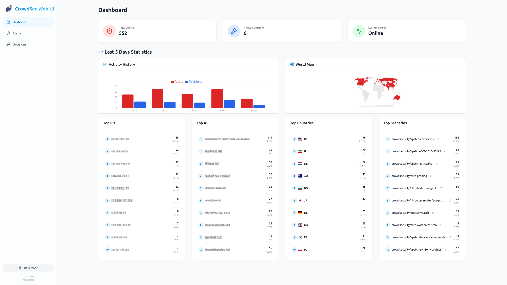
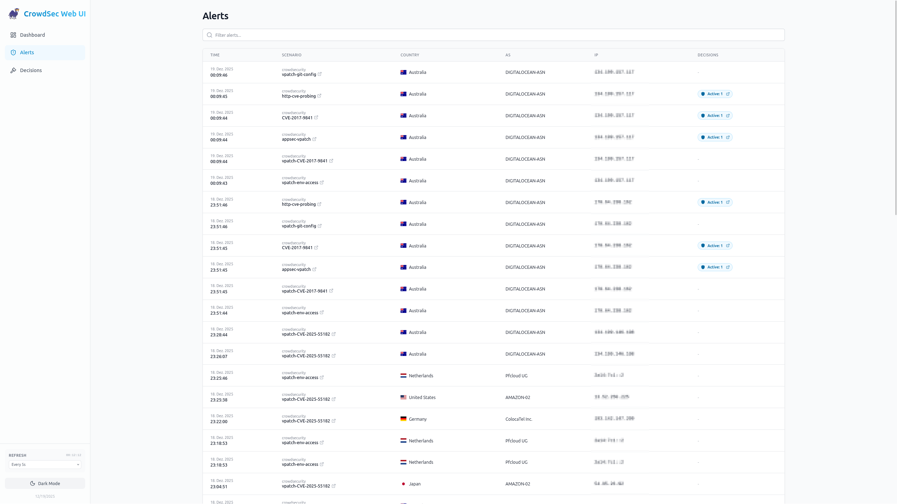
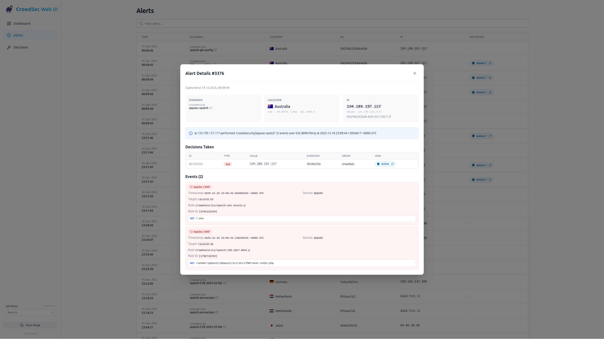
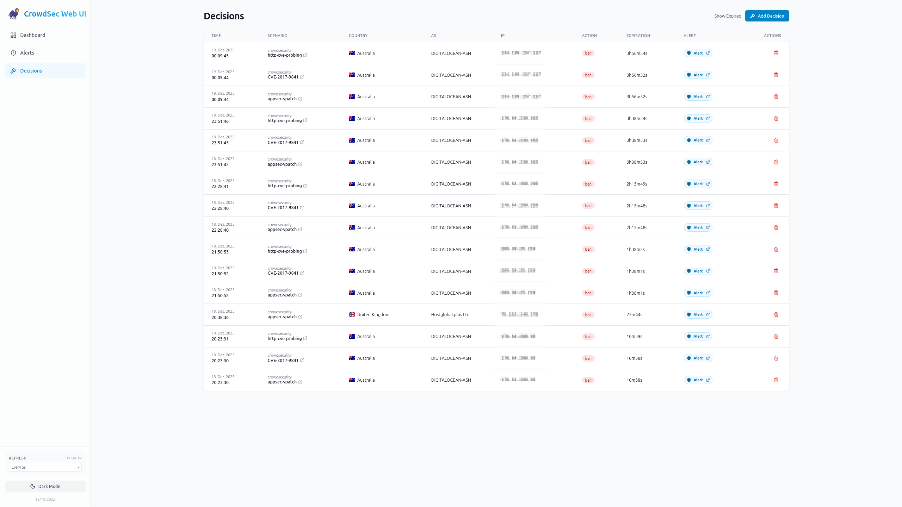
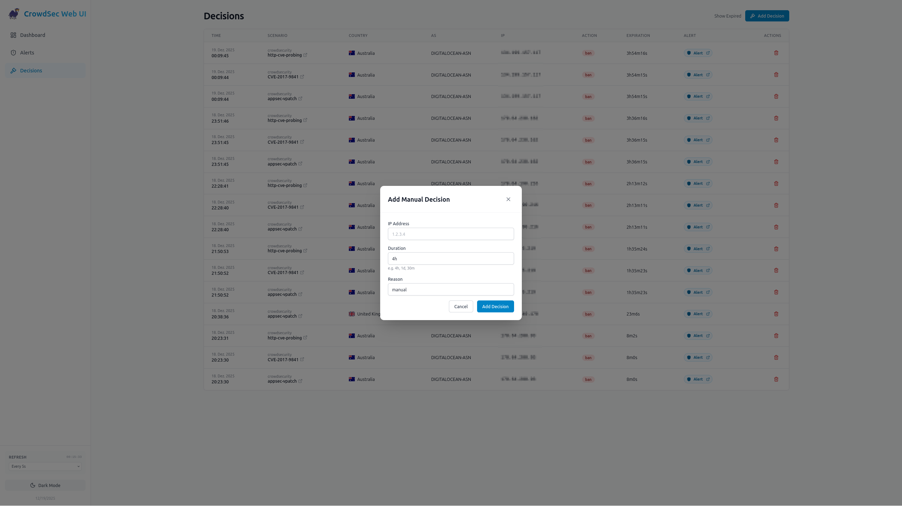

<div align="center">
  
</div>

<div align="center">

  
  
  
  [](https://github.com/users/TheDuffman85/packages/container/package/crowdsec-web-ui)

</div>

# CrowdSec Web UI

A modern, responsive web interface for managing [CrowdSec](https://crowdsec.net/) alerts and decisions. Built with **React**, **Vite**, and **Tailwind CSS**.

<div align="center">
  
  
  
  
  
</div>

## Features

### Dashboard
High-level overview of total alerts and active decisions. Statistics and top lists with dynamic filtering. 

<a href="screenshots/dashboard.png">
  
</a>

### Alerts Management
View detailed logs of security events.

<a href="screenshots/alerts.png">
  
</a>

### Alert Details
Detailed modal view showing attacker IP, AS information, location with map, and triggered events breakdown.

<a href="screenshots/alert_details.png">
  
</a>

### Decisions Management
View and manage active bans/decisions. Supports filtering by status (active/expired) and hiding duplicate decisions.

<a href="screenshots/decisions.png">
  
</a>

### Manual Actions
Ban IPs directly from the UI with custom duration and reason.

<a href="screenshots/add_decision.png">
  
</a>

### Update Notifications
Automatically detects new container images on GitHub Container Registry (GHCR). A badge appears in the sidebar when an update is available for your current tag.

### Modern UI
-   **Dark/Light Mode**: Full support for both themes.
-   **Responsive**: Optimized for mobile and desktop.
-   **Real-time**: Fast interactions using modern React technology.

> [!CAUTION]
> **Security Notice**: This application **does not provide any built-in authentication mechanism**. It is NOT intended to be exposed publicly without protection. We strongly recommend deploying this application behind a reverse proxy with an Identity Provider (IdP) such as [Authentik](https://goauthentik.io/), [Authelia](https://www.authelia.com/), or [Keycloak](https://www.keycloak.org/) to handle authentication and authorization.

## Architecture

-   **Frontend**: React (Vite) + Tailwind CSS. Located in `frontend/`.
-   **Backend**: Node.js (Express). Acts as an intelligent caching layer for CrowdSec Local API (LAPI) with delta updates and optimized chunked historical data sync.
-   **Database**: SQLite (better-sqlite3). Persists alerts and decisions locally in `/app/data/crowdsec.db` to reduce memory usage and support historical data.
-   **Security**: The application runs as a non-root user (`node`) inside the container and communicates with CrowdSec via HTTP/LAPI. It uses **Machine Authentication** (User/Password) to obtain a JWT for full access (read/write).

## Prerequisites

-   **CrowdSec**: A running CrowdSec instance.
-   **Machine Account**: You must register a "Machine" (Watcher) for this web UI to allow it to push alerts (add decisions).
    
    1.  Generate a secure password:
        ```bash
        openssl rand -hex 32
        ```
    2.  Create the machine:
        ```bash
        docker exec crowdsec cscli machines add crowdsec-web-ui --password <generated_password> -f /dev/null
        ```
        > [!NOTE]
        > The `-f /dev/null` flag is crucial. It tells `cscli` **not** to overwrite the existing credentials file of the CrowdSec container. We only want to register the machine in the database, not change the container's local config.

## Run with Docker (Recommended)

1.  **Build the image**:
    ```bash
    docker build -t crowdsec-web-ui .
    ```

2.  **Run the container**:
    Provide the CrowdSec LAPI URL and your Machine Credentials.
    
    ```bash
    docker run -d \
      -p 3000:3000 \
      -e CROWDSEC_URL=http://crowdsec-container-name:8080 \
      -e CROWDSEC_USER=crowdsec-web-ui \
      -e CROWDSEC_PASSWORD=<your-secure-password> \
      -e CROWDSEC_LOOKBACK_PERIOD=5d \
      -e CROWDSEC_REFRESH_INTERVAL=0 \
      -v $(pwd)/data:/app/data \
      --network your_crowdsec_network \
      crowdsec-web-ui
    ```
    *Note: Ensure the container is on the same Docker network as CrowdSec so it can reach the URL.*

### Docker Compose Example

```yaml
services:
  crowdsec-web-ui:
    image: ghcr.io/theduffman85/crowdsec-web-ui:latest
    container_name: crowdsec_web_ui
    ports:
      - "3000:3000"
    environment:
      - CROWDSEC_URL=http://crowdsec:8080
      - CROWDSEC_USER=crowdsec-web-ui
      - CROWDSEC_PASSWORD=<generated_password>
      # Optional: Lookback period for alerts/stats (default: 168h/7d)
      - CROWDSEC_LOOKBACK_PERIOD=5d
      # Optional: Backend auto-refresh interval. Values: 0 (Off), 5s, 30s (default), 1m, 5m
      - CROWDSEC_REFRESH_INTERVAL=30s
      # Optional: Idle Mode settings to save resources
      # Interval to use when no users are active (default: 5m)
      - CROWDSEC_IDLE_REFRESH_INTERVAL=5m
      # Time without API requests to consider system idle (default: 2m)
      - CROWDSEC_IDLE_THRESHOLD=2m
      # Optional: Interval for full cache refresh (default: 5m)
      # Forces a complete data reload when active, skipped when idle.
      - CROWDSEC_FULL_REFRESH_INTERVAL=5m
    volumes:
      - ./data:/app/data
    restart: unless-stopped
```

### Run with Helm

A Helm chart for deploying `crowdsec-web-ui` on Kubernetes is available (maintained by the zekker6):
[https://github.com/zekker6/helm-charts/tree/main/charts/apps/crowdsec-web-ui](https://github.com/zekker6/helm-charts/tree/main/charts/apps/crowdsec-web-ui)

## Persistence

To persist alert history, decisions cache, and configuration across container restarts, mount the `/app/data` directory. All data is stored in a single SQLite database.

**Docker Run:**
Add `-v $(pwd)/data:/app/data` to your command.

**Docker Compose:**
Add the volume mapping:
```yaml
volumes:
  - ./data:/app/data
```

## Local Development

1.  **Install Dependencies**:
    ```bash
    npm run install-all
    ```

2.  **Configuration**:
    Create a `.env` file in the root directory with your CrowdSec credentials:
    ```bash
    CROWDSEC_URL=http://localhost:8080
    CROWDSEC_USER=crowdsec-web-ui
    CROWDSEC_PASSWORD=<your-secure-password>
    CROWDSEC_REFRESH_INTERVAL=30s
    ```

3.  **Start the Application**:
    The project includes a helper script `run.sh` to manage both services.

    **Development Mode** (Hot Reload):
    Starts both backend (port 3000) and frontend (port 5173).
    ```bash
    ./run.sh dev
    ```

    **Production Mode** (Optimized Build):
    Builds the frontend and starts the backend (port 3000).
    ```bash
    ./run.sh
    ```

## API Endpoints

The backend exposes the following endpoints (proxying to CrowdSec LAPI):

-   `GET /api/alerts`: List all alerts.
-   `GET /api/alerts/:id`: Get detailed information for a specific alert.
-   `GET /api/decisions`: List decisions (active by default). Supports `?include_expired=true`.
-   `POST /api/decisions`: Add a new decision (Body: `{ ip, duration, reason, type }`).
-   `DELETE /api/decisions/:id`: Delete a decision by ID.
-   `GET /api/stats/alerts`: Minimal alert data for Dashboard statistics.
-   `GET /api/stats/decisions`: List all decisions (including expired) for statistics.
-   `GET /api/config`: Get current configuration and LAPI connection status.
-   `PUT /api/config/refresh-interval`: Update the background refresh interval.
-   `GET /api/update-check`: Check for available container updates.
